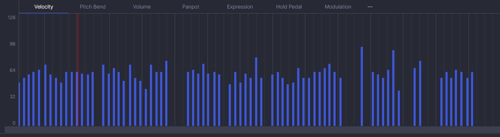
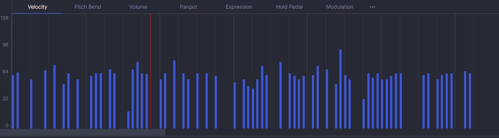

fake-drummer
============
### ChatGPT
> 1.  **Mean**: The average value of the generated samples.
> 2.  **Variance**: A measure of the spread of the generated samples around the mean.
> 3.  **Standard Deviation**: The square root of the variance, providing another measure of the spread of the generated samples.
> 
> By comparing these statistics to the input ECDF samples, you can
> assess how well the generated samples match the desired distribution.
> If the mean, variance, and standard deviation of the generated samples
> are close to those of the input samples, it suggests that the
> generated samples have a similar distribution.
> 
> Keep in mind that this is a basic approach, and depending on your
> specific requirements, you may need to use more advanced statistical
> tests to compare the distributions more rigorously.

### From

### To

